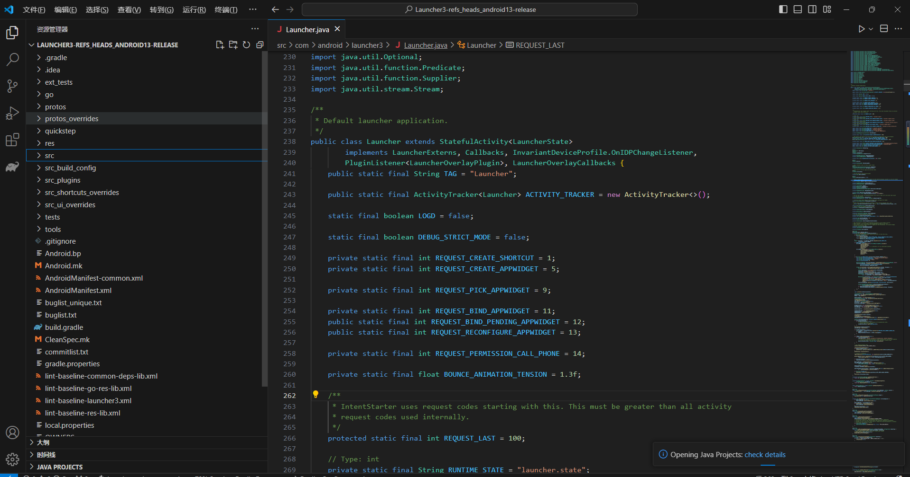
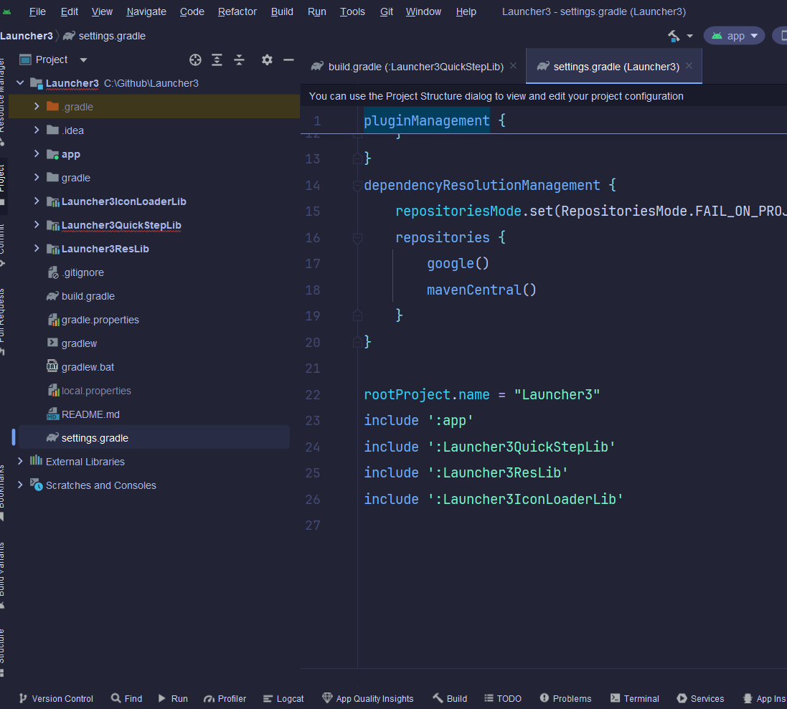
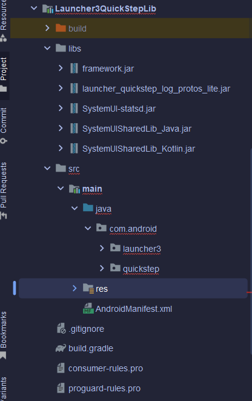
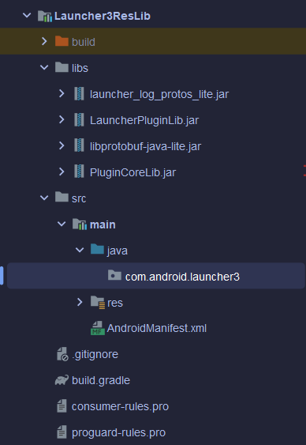
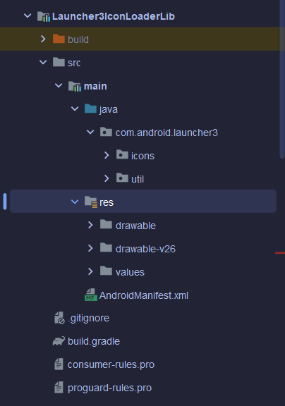
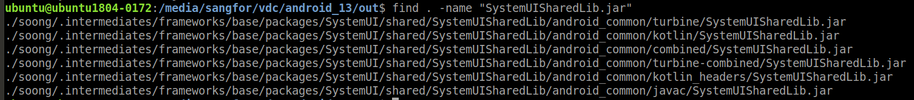
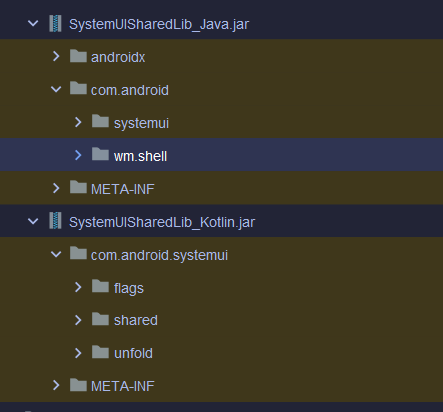
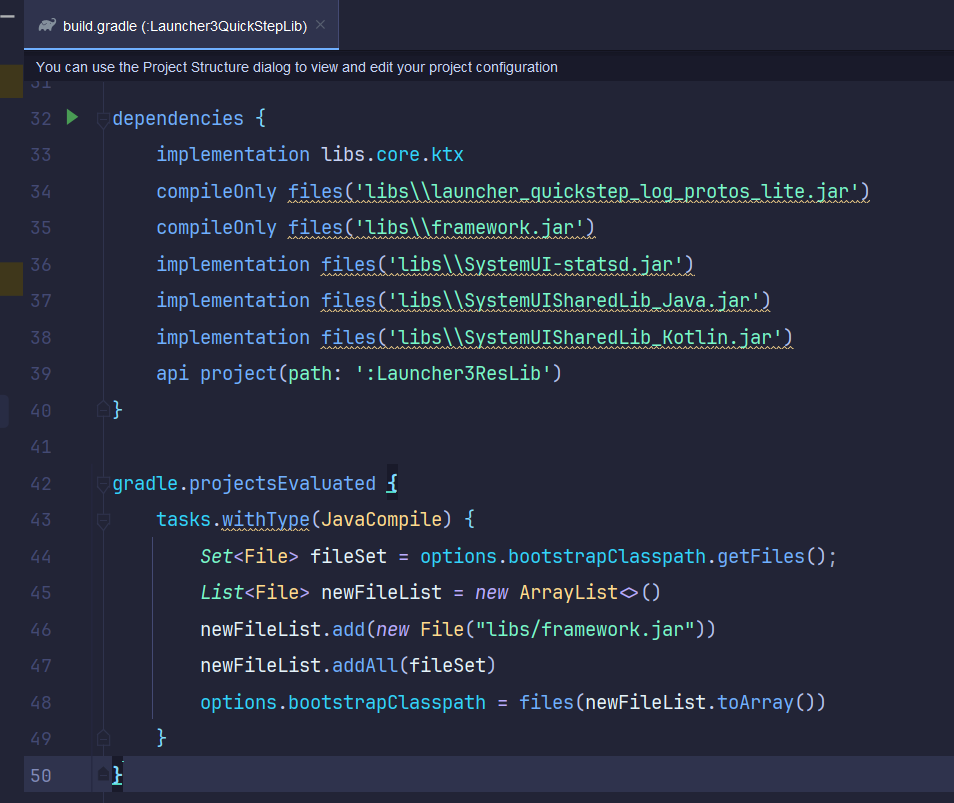

Android Studio 版本 Launcher3_Android_13.

Android 13 Aosp源码(https://android.googlesource.com/platform/packages/apps/Launcher3/+/refs/heads/android13-release)

源码版本

Android Studio版本

Launcher3QuickStepLib (主要代码)

Launcher3ResLib(主要资源)

Launcher3IconLoaderLib(图片加载，冲突资源单独新建)

需要值得注意的是：

SystemUISharedLib.jar 有kotlin和java下的，在 Launcher3QuickStepLib代码所依赖的资源中两个包都用到了，因此两个包都导入了。

将Aosp编译好的framework.jar加入环境使用，需要 compileOnly files(‘libs\framework.jar’)，并添加Grade脚本。
该Gradle脚本的作用是在所有项目被评估后，修改所有Java编译任务的引导类路径，将libs/framework.jar添加到这个路径中。这通常用于确保在编译过程中能够访问到特定的库或框架，这些库或框架可能不是Java标准库的一部分。
